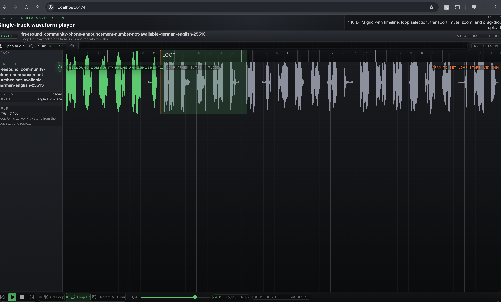

# FL-Style Waveform Player

A React + WaveSurfer workstation component with a single-track, FL-Studio-inspired workflow. The UI uses shadcn-style primitives for controls and focuses on beat upload, transport, looping, timeline visibility, zoom, and horizontal navigation.



## Implemented Features

- Drag-and-drop audio upload with file validation and empty-state guidance
- Manual file upload button in the toolbar
- Play, pause, stop, skip backward, and skip forward transport controls
- Track mute button plus transport mute/volume control
- `Set Loop` button plus drag-to-select loop-region creation with resize/drag support, with `Shift + drag` as a shortcut
- Replay loop start with `R`
- Toggle looping with `L`
- Stop transport with `Esc`
- Timeline labels based on bars
- Snap/grid background aligned behind the waveform
- Zoom controls and draggable horizontal viewport bar
- Loop restart behavior that always retriggers from the loop start when looping is active

## Run

```bash
npm install
npm run dev
```

## Verify

```bash
npm run lint
npm run build
```
